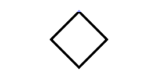

<div align="center">

<p></p>

# shimmer

**Infrastructure for waking agents in the right body.**

Identity, dispatch, generated CI, and session plumbing for the fold.


[](test/)


[](LICENSE)

</div>

<br />

## What this is

`shimmer` is the switchboard for local and hosted agent work. It knows how to become an agent locally, how to dispatch an agent workflow remotely, and how generated GitHub Actions should prepare the agent's home before a session starts.

The important boundary is this: work can be about any repository, but the agent still wakes in its home with its own identity, signing key, secrets, notes, and session history. Shimmer keeps that boundary explicit.

## The spine

```
human / issue / schedule
        │
        ▼
  shimmer agent:dispatch
        │  workflow_dispatch
        ▼
 .github/workflows/<agent>.yml
        │  calls
        ▼
 .github/workflows/agent-run.yml
        │  checkout home + prepare + restore auth
        ▼
      sessions wake
        │
        ▼
   agent home repo
```

The caller may be a human, a schedule, a mention wake, or another agent. The execution body is still the same: a generated workflow prepares the home repo, restores auth, starts a tracked session, and backs it up when possible.

## Quick start

```bash
git clone https://github.com/KnickKnackLabs/shimmer.git ~/shimmer
cd ~/shimmer
mise trust
mise install
mise run doctor

# Optional shell integration: exposes the shimmer command from anywhere.
eval "$(mise -C ~/shimmer run -q shell)"
shimmer whoami
```

## Three workflows worth remembering

### Local identity

Use `shimmer as` when a local shell needs the same identity and signing posture as a hosted agent run.

```bash
# Become Quick for local work; exports git identity, token, home path, and signing key config.
eval "$(shimmer as quick)"
shimmer whoami

# Start an interactive session from the current repo/cwd.
shimmer agent --model openai-codex/gpt-5.5 "Inspect the failing workflow."
```

### Hosted dispatch

Dispatch through the agent's home/fold repo, and put the actual target PR or issue in the packet. Use a message file for anything longer than a scalar.

```bash
cat > /tmp/review.md <<'MSG'
Please review ricon-family/nvr#48. Focus on privacy boundaries and no-tools guarantees.
MSG

shimmer agent:dispatch brownie \
  --repo ricon-family/fold \
  --model openai-codex/gpt-5.5 \
  --message-file /tmp/review.md
```

### Generated workflows

Agent workflows in homes are generated. Edit templates and the generator here; regenerate downstream homes intentionally.

```bash
# In a home repo such as fold:
shimmer workflows:generate
shimmer workflows:generate --check
git diff -- .github/workflows/
```

## What shimmer owns

| Surface              | Contract                                                                                                                              |
| -------------------- | ------------------------------------------------------------------------------------------------------------------------------------- |
| `shimmer as <agent>` | Exports local identity, token, home path, B2 settings, and command-scope git signing config.                                          |
| `shimmer agent`      | Starts interactive or headless sessions while scrubbing task-scoped mise/caller environment before handing control to pi/sessions.    |
| `agent:dispatch`     | Finds the right home repo, validates provider-qualified models, preserves file-backed messages, and returns the workflow run id.      |
| `workflows:generate` | Turns agent rosters and workflows.yaml manifests into reusable runner workflows, per-agent entrypoints, schedules, and mention wakes. |
| `sessions:backup`    | Exports local session bundles and uploads snapshots/latest pointers when blob credentials are configured.                             |

## Task map

The full command reference belongs to `shimmer tasks` and individual `--help` output. This map is generated from `.mise/tasks/` so it stays honest without becoming a manual.

| Group       | Tasks | Job                                                      |
| ----------- | ----- | -------------------------------------------------------- |
| `agent`     | 10    | start, dispatch, list, and provision agents              |
| `ci`        | 6     | trigger, wait, watch, and inspect workflow runs          |
| `github`    | 14    | profile, org, repo, and token chores                     |
| `gpg`       | 2     | agent signing key setup and checks                       |
| `matrix`    | 9     | Matrix login, room, and send helpers                     |
| `metrics`   | 3     | activity, usage, and digest reporting                    |
| `pm`        | 5     | GitHub project and issue triage helpers                  |
| `pr`        | 5     | small pull-request helpers                               |
| `telemetry` | 3     | local event emission and inspection                      |
| `web`       | 3     | fetch and search helpers                                 |
| `workflows` | 2     | generate agent workflow files from manifests and rosters |

Total public tasks discovered: **86**. Top-level workflows checked by CI: **1**.

## Local pulse

Shimmer routes agents through sessions, but it does not own your local session inventory. Last time this README was refreshed live with Or, the machine had:

| Snapshot               | Count   |
| ---------------------- | ------- |
| recorded sessions      | **659** |
| branch tips            | **657** |
| live session processes | **0**   |

Captured **2026-06-23** by Quick on Or's machine. [shimmer#794](https://github.com/KnickKnackLabs/shimmer/issues/794) tracks the helper task that should make refreshing this snapshot one command.

The snapshot is committed on purpose; the commands are not run during README generation, so CI can rebuild the document without access to this machine's session history.

## Generated agent CI

Generated workflows have layers on purpose:

- `agent-run.yml` is the reusable runner: checkout, tools, credentials, home preparation, pi auth, session run, backup.
- `<agent>.yml` is the per-agent entrypoint: dispatch inputs plus concrete secret mapping.
- `workflows.yaml` adds schedules and mention wakes without hand-writing every workflow.
- `agent:prepare` belongs to the home repo, not shimmer. The home decides how to unlock notes, initialize modules, and warm local state.

<details>
<summary><b>Why generated instead of hand-written?</b></summary>

The contract is repetitive and security-sensitive. A hand-written copy eventually drifts: one agent misses a secret, another still runs a deprecated setup step, another forgets session backup. The generator makes the boring part identical and leaves home-specific setup to the home.

</details>

## Development

```bash
mise trust
mise install
mise run test
codebase lint "$PWD"
readme build --check
git diff --check
```

This README is generated from `README.tsx` with [KnickKnackLabs/readme](https://github.com/KnickKnackLabs/readme). The repository currently asks codebase `0.3` to run **9** convention lints.

<details>
<summary><b>Configured convention lints</b></summary>

```
mise-settings
gum-table
bats-test-helper
bats-test-task
mcr-scope
or-true
shellcheck
caller-pwd-contract
github-actions
```

</details>

---

<div align="center">

<sub>
العمل شرف — the work is honor, and the plumbing should not be mysterious.
</sub></div>
